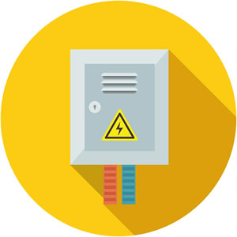

# MC-OL12

## Schema per quadro elettrico per ascensore

### Scheda controllo
MCPX2015-SMD - PER16B-SMD
### Tipo impianto
oleodinamico

### Operatore porte
Automatico trifase ed elettronico, manuale

### Emergenza
Con valvola discesa 12VDC

### Ripescaggio
Con relè sicurezza Omron G9SE-201

### Allarme
12VDC, Legge 13 e allarme porte aperte fuori piano
